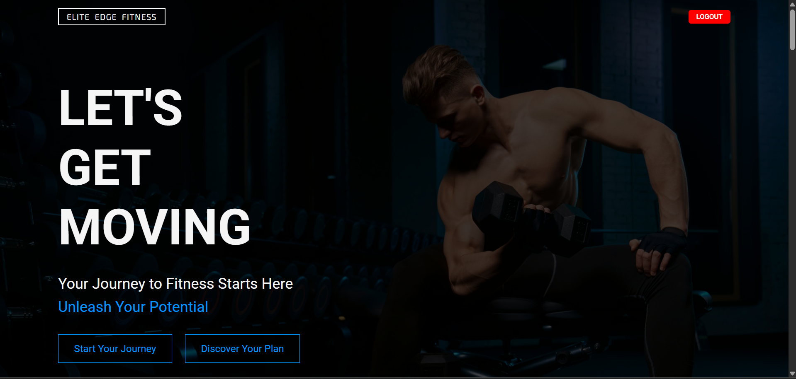
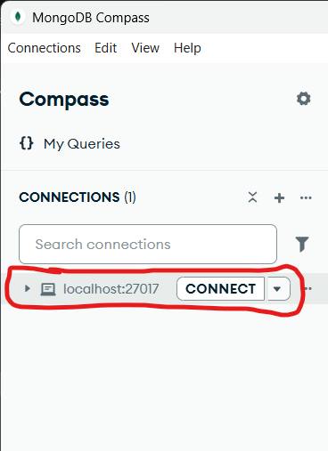

# 💪 MERN Stack Gym Website with Email Functionality

A full-featured MERN Stack-based fitness website that includes user authentication, protected routes, and contact form functionality with email delivery using SMTP.

## 🚀 Features

- 🔐 User Signup & Login (with protected homepage)
- 📨 Contact Form with Email Sending via Gmail SMTP
- 📷 Image-rich Homepage with Workout & Pricing Sections
- 📊 BMI Calculator
- 🔒 Logout functionality
- 🖥️ Built with React, Node.js, Express, MongoDB

---
## ⚙️ Environment Setup

### 1. Clone the Repository

```bash
git clone https://github.com/Waliii31/MERN_GYM_WEBSITE.git
```

```bash
cd MERN_GYM_WEBSITE
```

### 2. Configure Environment Variables
There are two .env files to configure:

## frontend/.env
```bash
VITE_BACKEND_URL=http://localhost:your-backend-port
```
This URL should point to your backend server.

## backend/config.env

```bash
FRONTEND_URL=http://localhost:5173
PORT=your-backend-port
MONGO_URI=mongodb://localhost:your-connection-port/gymWebsite

SMTP_HOST=smtp.gmail.com
SMTP_PORT=587
SMTP_SERVICE=gmail
SMTP_MAIL=your-email@gmail.com
SMTP_PASSWORD=your-app-password

## Replace the values with your own:
```

Use MongoDB Compass or your preferred method to get a MongoDB connection URI.

For email, create a Gmail App Password and use it as SMTP_PASSWORD.

# 🛠️ Running the Application
## 1. Start MongoDB

Make sure your MongoDB database is running.

If you're using MongoDB Compass:

Open it.

Click "Connect".



Copy the connection string and paste it into your config.env like:

``` bash
MONGO_URI=mongodb://localhost:27017/gymWebsite
```

2. Open Two Terminal Windows
Terminal 1 – Start the Backend
```bash
cd backend
npm install
npm run dev
```
Terminal 2 – Start the Frontend
```bash
cd frontend
npm install
npm run dev
```
🌐 Using the App
Open your browser and go to:
👉 http://localhost:5173

You will land on the Signup Page. Register a new account.

On successful signup, you’ll see an alert and be redirected to the Login tab.

Log in using the registered credentials to access the Homepage.

Scroll down to the Contact Us section and fill the form. When you click Send Message, an email will be sent to the email address specified in the backend .env.

To log out, click the Logout button in the navigation bar.

# ✅ Tech Stack
1. Frontend: React + Vite + Tailwind CSS
2. Backend: Node.js + Express.js
3. Database: MongoDB (local or Atlas)
4. Email: Nodemailer + Gmail SMTP

📬 Contact
For any questions or suggestions, feel free to reach out via issues or pull requests.

🏁 Final Notes
Make sure your .env files are never committed to GitHub. Always add them to .gitignore.

Test email functionality before deployment to ensure Gmail SMTP is properly configured.

Enjoy building your fitness journey with this template! 💥